# A koino gépezete — képekben

*Létrehozva: 2026-09-07, Csaba kérésére: „elég összetett rendszer ez ahhoz, hogy készítsünk
egy infografikus dokumentációt."*

> **Mi ez a dokumentum?** A koino **döntés-gépezetének** képei: mi történik egy javaslattal
> a beadástól a végrehajtásig, mi lesz egy entitással, és mi lesz a tudatponttal.
>
> ⚠️ **Két külön része van, és a különbség fontos:**
>
> - Az **1–4. ábra** azt írja le, ami **megépült és próbákkal őrzött**. Ez a mai koino.
> - Az **5–6. ábra** **TERV** — Csaba modellje az egyesítés/különválásra, és az általános
>   javaslat→egyezmény terve. *Ezeket a képet javítva vitatjuk meg, nem a szöveget.*
>
> A képek `mermaid` alakban vannak: a GitHub, a Claude Code és a legtöbb szerkesztő
> rendereli, a nyers szöveg pedig olvasható marad — nulla függőség (6. szabály).

---

## 1. A HÁROM FÁZIS — miért nem lehet kettő

Az állapot nem tárolt adat, hanem **számítás** az aláírt eseményekből (D17). A számítás
három lépésben megy, és **a sorrend nem cserélhető fel**.

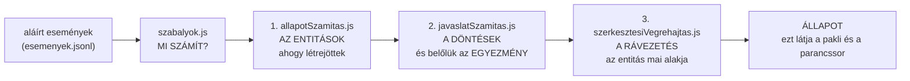

**Miért három:**

- a **döntéshez** kell az állapot — a küszöbök a tulajdonosok érték javaslatainak mediánja,
  a részvételi arány nevezője az aktív tulajdonosok köre;
- az **entitás végleges alakjához** kell a döntés — az elfogadott egyezmény írja át a címet,
  helyezi át, tünteti el vagy olvasztja be.

⭐ **A `koino.js` és a `pakli.js` UGYANEZT a hármat futtatja** — ezért mond ugyanazt a
parancssor és a lap. *Ha a felület „javítaná ki" a címet, két igazság lenne.*

⚠️ Ez a három fázis **egy valódi rést zárt be** (2026-09-06, mérve): a javaslat elfogadódott,
az egyezmény megszületett — a gondolat címe mégis a régi maradt, mert a 3. fázis hiányzott.

---

## 2. A TÖREDÉK-MODELL — egy javaslat, N döntés, ÉS

Egy javaslat **több entitást is érinthet**, és ilyenkor **nem egy szavazás van**. A
prototípus töredékekre bontja; a koinóban ugyanez **számítás** (`reszekSzamitasa`).

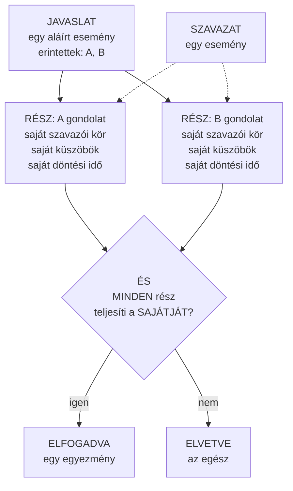

**A négy szabály, amit ez a kép mond ki:**

| | |
|---|---|
| **A beadáshoz** metszet kell | *„tudatpont MINDEN érintett entitáson"* — enélkül egy egyesítést be lehetne adni úgy, hogy a másik gondolathoz semmi közöd |
| **A szavazáshoz** nem | egy szavazat **abban a részben** számít, ahol a szavazónak van pontja; a többi rész **átugorva** |
| **A lezárás közös** | a leghosszabb rész-döntési idő — a csoport egyben dől el |
| **Az elfogadás ÉS** | egyetlen elbukó rész az egész javaslatot elveti |

⭐ *Aki a gondolatot tartja, az dönt a sorsáról — akkor is, ha a javaslat egy másikat is
érint.*

---

## 3. AZ ENTITÁS ÉLETÚTJA — háromféle eltűnés, három következmény

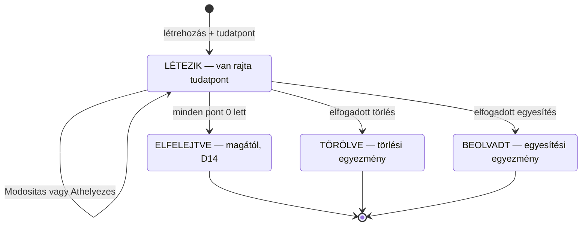

**A három eltűnés NEM ugyanaz — a tudatpont sorsa dönti el:**

| Eltűnés | Mi lesz a rátett tudatponttal | Mi lesz a gyerekeivel |
|---|---|---|
| **Elfelejtve** (D14) | már 0 volt, nincs mit menteni | **felkerülnek** a legközelebbi élő felmenőhöz |
| **Törölve** | **elakad** — a gazdának vissza kell vennie (4. ábra) | **felkerülnek** a legközelebbi élő felmenőhöz |
| **Beolvadt** | **átmegy** az elnyelőre, emberenként összeadva | **az ELNYELŐHÖZ** kerülnek, nem a nagyszülőhöz |

⛔ **Ez a különbség nem részletkérdés.** Ha a felszabadítás a puszta „eltűnt" listát nézné, a
beolvasztott forrásra is ráírna egy `pont: 0`-t — és a következő számításnál az egyesítés
**nem találná meg a pontokat**, vagyis a felszabadítás **elvenné, amit megőrizni akar**.
*Ugyanaz a szó, két ellentétes következmény.*

⭐ **Az árvák felkerülése** a prototípus kaszkádja: *a gondolat nem tűnhet el csak azért, mert
a szülőjét elfelejtették.* ⚠️ De csak azon a szülőn lépünk át, amit **ismertünk és eltűnt** —
amit **sosem láttunk**, ahhoz nem nyúlunk: az hiány, nem tény (D19).

---

## 4. A TUDATPONT ÚTJA — a kerettől az elakadásig és vissza

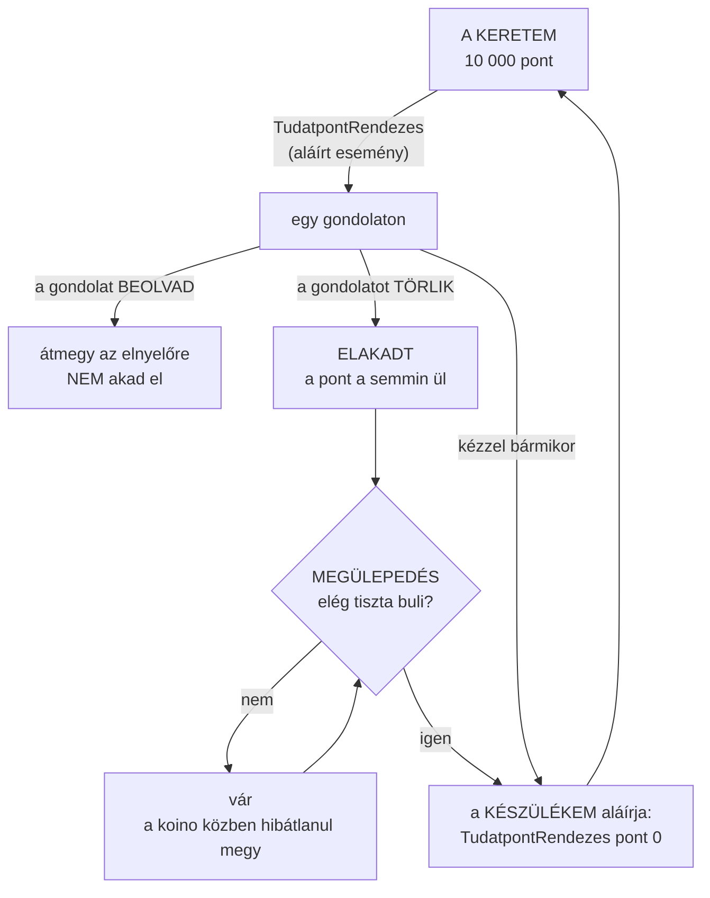

**Miért van egyáltalán elakadás?** Mert a gondolat **törlődik** (az eltűnés számítás az
egyezményből, minden készüléken ugyanaz), a pontot viszont csak a **gazdája** veheti le —
a tudatpont-rendezés aláírt esemény, és senki nem írhat alá helyettem (D15).

⭐ **De a készülékem igen** — az az én kulcsom, az én gépem: nem más ír alá helyettem, hanem
a saját készülékem könyvel.

### A megülepedés: BULI, nem óra

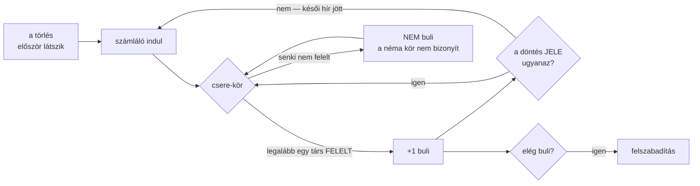

⚠️ **Miért nem óra?** *Az idő múlása semmit nem bizonyít* — egy hétvégén kikapcsolt készülék
mellett három nap alatt sem érkezik semmi, egy sűrűn cserélő mellett viszont öt perc alatt
körbeér minden. A buli **azt méri, ami történik**: hogy beszéltem másokkal, és nem hoztak újat.

⚠️ **A döntés jele** = az egyezmény + a lezárás ideje + **a szavazás állása**. Az utolsó tag
egy próbából jött: egy késve érkező szavazat, ami a bizonyosságot nem mozdítja, **nem
változtatja meg a lezárás idejét** — pedig épp azt jelzi, hogy még mindig érkeznek késői
események. *Amit mérni akarunk, az nem a döntés stabilitása, hanem a CSEND.*

### ⭐⭐⭐ ÉS A FŐ JEL MÁR NEM A BULI — hanem a láncok vége (2026-09-08)

A buli-számot **megmértük**, és a mérés megcáfolta (`meres/eredmenyek.md` 13.): a hálózat
lassúsága ellen olcsón véd (mindenki ébren: K=2 → 0%), de **az alvó készülék ellen semmilyen
véges szám nem véd** (20 kör alvásnál K=8 mellett is 100% a korai felszabadítás). ⭐ *Rossz
dolgot számoltunk: a hálózat terjedési idejét, nem azt, hogy az érintett emberek megszólaltak-e.*

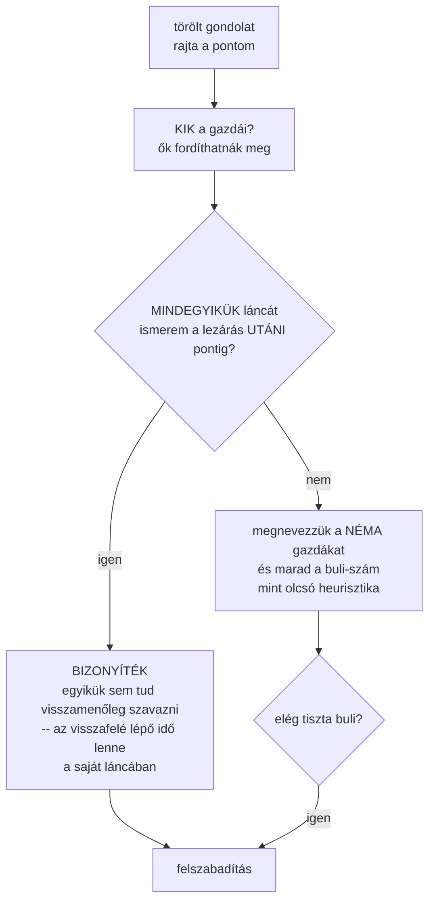

⭐ **Elég az egyik** — de a kettő nem egyenrangú: a lánc-igazolás **állítás a döntésről**, a
buli-szám csak **jel a hálózatról**. Ezért a terv megmondja, melyik alapján szabadított fel.

---

## 5. ⏸️ TERV: EGYESÍTÉS ÉS KÜLÖNVÁLÁS — Csaba modellje

> ⚠️ **Ez még nincs megépítve.** A mai kód egyszerűbb: az **első** érintett olvasztja be a
> többit, és nincs külön ág. Az alábbi kép Csaba 2026-09-07-i modellje — *ezt javítsuk.*

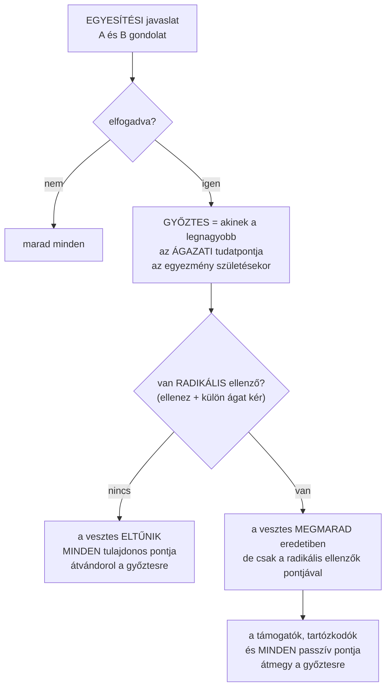

**A leszármazottak — egyenként, ugyanezzel a szabállyal:**

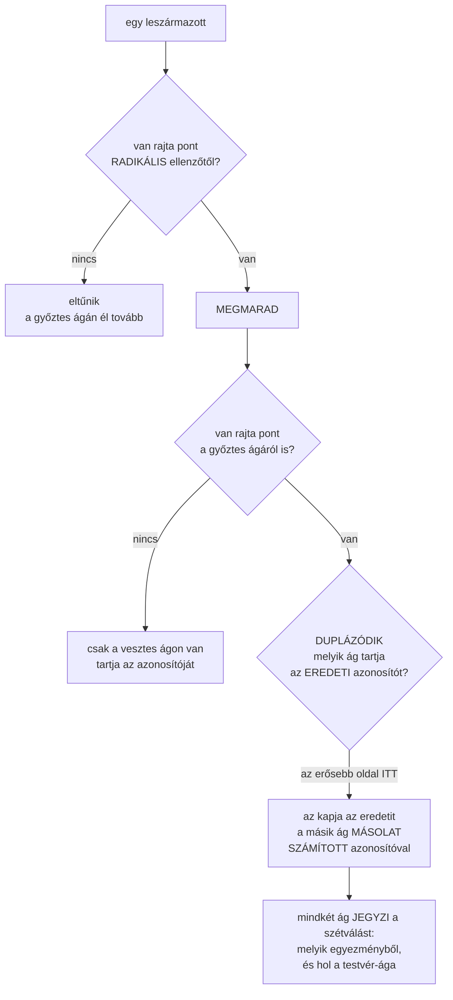

### ⭐ „A láncok tudnak ennyire rugalmasak lenni?" — igen, és megnéztem, miért

Csaba kérdése (2026-09-07): *lehet, hogy jobb lenne, ha leszármazottanként az erősebb oldal
tartaná meg az azonosítót — számít ez technikailag?*

**Technikailag semmi nem áll az útjában, és ennek pontos oka van:** a láncokat **soha nem
írjuk át**. Egy aláírt esemény, ami az `X` azonosítóra hivatkozik (`adat.entitas`,
`adat.szulo`, `adat.javaslat`), örökre `X`-re fog hivatkozni. ⭐ **Nem a hivatkozásokat
mozgatjuk, hanem azt SZÁMÍTJUK ki, melyik ág viseli melyik nevet** — és mivel ez számítás
aláírt eseményekből, minden készüléken ugyanaz jön ki. *A rugalmasság nem a láncokban van,
hanem abban, hogy az állapot amúgy sem tárolt, hanem levezetett.*

Ugyanez a gépezet már ma is dolgozik: az egyesítésnél a **pontok** is átkerülnek egy másik
entitásra anélkül, hogy bárki láncát átírnánk — a láncod továbbra is azt mondja, „X: 100", az
állapot pedig azt, hogy ez a 100 pont most az elnyelőn ül.

⚠️ **Két valódi következménye viszont van, és ezeket ki kell mondani:**

1. **Az azonosító a TÖRTÉNETET is hozza.** Aki az eredeti azonosítót kapja, az örökli az
   összes már aláírt hivatkozást: a tudatpontokat, az érték javaslatokat, a rá mutató
   gyerekeket, a róla szóló javaslatokat. A másolat **üresen indul**, és csak azt kapja, amit
   a számítás kifejezetten átad neki.
2. ⛔ **Az eredeti azonosító ELHOZHATÓ, a számított nem.** A `hozd <azonosító>` a társaktól
   kéri el az *eseményt* — az eredeti azonosítóhoz tartozik ilyen, a számítotthoz nem. A
   másolathoz **a forrásokat és az egyezményt** kell elhozni, és utána kiszámolni. *A `hozd`-nak
   ezt meg kell tanulnia; ez nem akadály, hanem feladat.*

### ⭐⭐ És a kérdés, ami emiatt NEM technikai, hanem jelentésbeli

Ha valaki egy éve hivatkozott `X`-re, és ma `X` a **radikális ellenzők** változatát jelöli,
akkor a régi hivatkozás némán az ellenvéleményhez visz — anélkül, hogy a hivatkozó bármit
tett volna. Fordítva ugyanez igaz.

⭐ **A javaslatom, ami mindkét utat biztonságossá teszi:** ne azon múljon a folytonosság,
hogy eltaláljuk, ki „érdemli" az azonosítót, hanem azon, hogy **a szétválás LÁTSZIK**. Mindkét
ág jegyezze, hogy szétválásból származik: **melyik egyezményből**, és **hol a testvér-ága**.
Akkor a régi hivatkozás odaér, és ott azt látja: *„ez a szétválás egyik ága, a másik itt van."*
Ugyanaz a minta, mint a `kihagyottak` listánál: **bejelent, nem hallgat** (D19).

### ✅ ÉS A MEGJELENÍTÉS MÁR MEGVAN — a kártya örökli (Csaba, 2026-09-08)

*„Azt hiszem a módosítási javaslat esetében létrejövő szétválásnál már van is erre egy fül a
kártyán, amibe a másik verziójának a hivatkozása van."* — **Így van**, és nem kell kitalálni:
a `frontend/js/components/kartya/GondolatKartya.js` **„Másik ág" füle** pontosan ezt teszi.

Amit a kártya vár — ez tehát a **kötelező alak**, amit a számításnak elő kell állítania:

```
kulonvalasok: [{ testverId, testverTipus, testverCim, agSzerep, kulonvalasIdeje }]
```

- **`agSzerep: 'foag'`** — *„a főág tartotta meg az eredeti azonosítót"* (a prototípus saját
  kommentje). ⭐ A koinóban ez a mező mostantól **azt jelenti, hogy ez az ág viseli az
  eredeti azonosítót** — így a Csaba-féle leszármazottankénti szabállyal is helyes marad,
  akkor is, ha az eredetit nem a „győztes" oldal kapja.
- A fül **két mondat közül** választ: *„Ez a gondolat kettévált: egy részük külön ágon
  folytatta"* vagy *„Ez a gondolat egy szétválásból született: egy másik ágból vált ki."*
- ⭐ És kezeli azt is, hogy **a testvér időközben megszűnt** — *„A másik ág időközben
  megszűnt."* (D14: a szétvált ág is elfelejtődhet, ha elfogy alóla a tudatpont.)

*Megint ugyanaz a tanulság, mint az egész átültetésnél: a prototípus kártyája megmondja, mit
kell a számításnak kiszámolnia.*

### ✅ A MÉRCE: FEJSZÁM, MINDENHOL (Csaba, 2026-09-08)

> *„legyen csak fej szám."*

⚠️ **Ez felülírja a korábbi döntést**, ami a győztest az **ágazati tudatpont** szerint
határozta meg. Egy gépezetben egy mérce: **hány EMBER áll mögötte**, se a tetején, se a
levelein nem más.

- **A győztes** az egyesítésnél: amelyik entitásnak **több tudatpont-tulajdonosa van**.
- **A leszármazottaknál**: ahol a **radikális ellenzők többen vannak**, mint a többiek, ott
  ők tartják az eredeti azonosítót.
- ⭐ **A hierarchikus változat** (ha az ágra kell nézni, nem csak az entitásra): az ágban
  előforduló **KÜLÖNBÖZŐ emberek száma** — pontosan az „ágazati tudatpont" megfelelője, csak
  pont helyett fővel. *(Ez az én olvasatom; ha az entitásra magára gondoltál, az egyszerűbb.)*

⏸️ **Holtverseny**: ha a két oldal egyenlő, kell egy döntő. Javaslat: az azonosító szerint
kisebb kapja az eredetit — ugyanaz a mintázat, mint az elágazás-feloldásnál. *Determinisztikus,
és nem jutalmaz senkit.*

### ⏸️ Amit még el kell dönteni

✅ **Eldőlt (2026-09-08): FEJSZÁM, mindenhol** — lásd fentebb. Ami még nyitva: a holtverseny döntője.

### A három döntés, amit ez a kép rögzít (Csaba, 2026-09-07)

1. **A győztes az ágazati (hierarchikus) tudatpont szerint dől el** — nem a felsorolás
   sorrendje szerint —, és **az egyezmény születésének pillanatában** érvényes érték számít
   (minden gépen ugyanaz, és később nem mozdul).
2. **A „radikális ellenző" = aki ellenzett ÉS külön ágat kért.** Ez a prototípus
   `kulonvalasIgeny` mezője: szavazáskor kérdezik meg, *„ha a döntés nem a te álláspontodat
   követi, kérsz-e külön ágat?"* — tartózkodásnál a kérdés meg sem jelenik. ⚠️ Ehhez a
   `Szavazat` eseménynek **új mezőt kell kapnia**.
3. **A másolat azonosítója SZÁMÍTOTT** — az eredetiéből és az egyezményéből származik.

### ⭐ És amivel ez a harmadik pont NEM megy szembe

Megnéztem: **nincs olyan leírt szabály, amit ez megsértene.** A koino szabálya az
**eseményről** szól (`js/esemeny/esemeny.js`): *„az azonosító a gondolat lenyomata, tehát nem
külön adat, hanem a gondolat neve"* — és ez **érintetlen marad**: minden esemény azonosítója
továbbra is a saját tartalmának lenyomata, ez hitelesíti az aláírást.

Ami változik, az egy **kimondatlan feltevés**: ma minden *entitás* azonosítója történetesen
egyszersmind egy *esemény* azonosítója is. A javasolt kimondás:

> ⭐ **Minden azonosító aláírt eseményekből SZÁMÍTHATÓ.** A lenyomat ennek a különleges
> esete: ott a számítás maga az azonosság.

**Két helyen van gyakorlati következménye, és mindkettőre van válasz:**

- az `allapotSzamitas.js` ma az entitás azonosítójával keresi meg a **létrehozó eseményt** —
  a másolatnál nincs ilyen, tehát a másolatot a végrehajtás **állítja elő** (ahogy az
  egyezményt is);
- a `hozd <azonosító>` böngésző-lekérés ma a **társaktól kéri el** az eseményt — egy
  számított azonosítóra ez nem működik, viszont nem is kell: aki a forrás-eseményeket
  ismeri, az **kiszámolja**. A `hozd`-nak ezt tudnia kell.

⚠️ *És egy őszinte megjegyzés: ezzel a lépéssel a koino elfogad egy olyan nevet, ami mögött
nincs egyetlen aláírás — csak egy levezetés. A levezetés bemenete viszont végig aláírt, és
minden gép ugyanoda jut. A D17 szelleme szerint ez rendben van; de ez az első ilyen név,
ezért írjuk le, ne csússzon be észrevétlenül.*

---

## 6. ⏸️ ELHALASZTVA: AZ ALKOTMÁNY — a terv áll, a megépítés vár

> ⛔⛔ **CSABA DÖNTÉSE (2026-09-11): EGYELŐRE NEM ÉPÍTJÜK MEG.**
> *„Mivel ez még nem építőköve semminek, ezért bele lehet rakni később is."*
>
> ⭐ **Az indok mérhető, nem vélemény:** az `Alkotmany` **tisztán additív** lenne —
> `GondolatLetrehozas` + `adat.tipus` (mint a `Kategoria`), a szavazás a meglévő
> `Szavazat`, a státusz pedig **számítás**. Nincs új esemény-fajta, **egyetlen meglévő tár
> sem évül el, egyetlen régi esemény sem lesz érvénytelen.** Később ugyanannyiba kerül,
> mint most, tehát a **9. szabály** próbája (*„a szerkezetet nem lehet utólag beletenni"*)
> nem fogja meg: ez **funkció, nem szerkezet**.
>
> ⭐ És a legdrágább darabja — a hiszterézis miatti **újrajátszás** — pont az, aminek ma
> nincs használója.
>
> ⛔⛔ **DE EGY DOLGOT NE HIGGYÜNK EL KÖZBEN: az ÉRTÉK JAVASLAT NEM AD STATIKUSSÁGOT.**
> Felmerült, hogy *„az értékjavaslatokkal bármelyik entitást statikussá lehet tenni"* —
> **a kód szerint nem.** A küszöb a tulajdonosok érték javaslatainak **mediánja**, minden
> számításnál újra (`javaslatSzamitas.js`, `kuszobokItt`), és az `ErtekJavaslat` **nem
> javaslat**: nincs mögötte szavazás, küszöb vagy döntési idő. Vagyis a 67%-os küszöb
> **felállításához** semmi nem kell, és a **visszavételéhez sem** — elég, ha a medián
> arrébb csúszik. ⛔ Sőt: a küszöb választóköre **önmagát választja**, mert a `kuszobokItt`
> azokat veszi be, akiknek van tudatpontjuk az entitáson — tudatpontot pedig **bárki tehet
> bárhova**. Tíz ember egy-egy ponttal és egy 51-es érték javaslattal átbillenti egy
> kilenc tulajdonosú gondolat 67-es mediánját. *A lakat kulcsa a lakaton lóg.*
> ⭐ **Ez nem hiba** (a D4 pontosan ezt akarja: *„a medián matematikailag is szavazás"*) —
> de azt jelenti, hogy amit az érték javaslat ad, az nem statikusság, hanem **lassúság**.
>
> ⚠️ **És amiért a pénzhez az alkotmány NEM is lett volna jó eszköz:** a **D27/6** a
> D64-ben is áll — *az alkotmány szövegéből semmi nem következik automatikusan*. Egy
> „alkotmány a pénzről" nem korlátozta volna a pénz-kiállítást, csak **látszott** volna
> mellette. A helyes eszköz ott a **kötött mezőkészletű javaslat**, amit a **számítás**
> tud ellenőrizni (Csaba: *„nem olyan szabad formában, hanem megírt forma szerint, amiben
> az értékeket kell meghatároznia"*) — erre a `KATEGORIA_KORLAT` a precedens: a korlát a
> **számításban** van, nem a mediánban.
>
> ⭐⭐ **Az alkotmány valódi helye tehát nem a „statikus szöveg", hanem a D65 rése:** az a
> mechanizmus, amivel a közösség a **saját állandóit** állítja. Amíg az nincs meg, a
> koino kemény szabályait az állítja, aki a programot írja.
>
> **Az alábbi terv ÉRVÉNYES marad** — a gondolatmenet nem évül el, és a megépítés bármikor
> ráülhet. Csak nem most.

### A TERV (2026-09-10): az alkotmány — a közösség álláspontja, saját entitás-típussal

> ⛔⛔ **EZ FELVÁLTJA A KORÁBBI „ÁLTALÁNOS JAVASLAT → EGYEZMÉNY" TERVET (Csaba, 2026-09-10):**
> *„Az általános javaslat teljesen más, mint a szerkesztési javaslat, ezért legyen külön
> entitás típus. Legyen inkább **alkotmány** a neve."*
>
> A D27 **szerkesztési** ága érvényes marad; az **általános** ága ezzel tárgytalan.

### A) A KÉT GÉPEZET — és miért nem lehet egy

A koinóban mostantól **kétféle igazság** van, és a különbség nem árnyalat:

| | **Szerkesztési javaslat** | **Alkotmány** |
|---|---|---|
| Mifajta állítás | **esemény**: megtörtént, egy pillanatban, véglegesen | **állapot**: igaz MOST, ameddig igaz |
| Lezárás | van (min/max döntési idő, bizonyossági mutató) | ⛔ **nincs** |
| Küszöb | a tulajdonosok érték javaslatainak **mediánja** (D4) | ⛔ **rögzített**: 2/3 és 1/3 |
| Nevező | aktív tulajdonosok ∪ szavazók | **a szülő ÖSSZES tulajdonosa, a passzívak is** |
| A hallgatás | nem korlátoz | ⛔ **NEM-et jelent** |
| Elfogadás után | végrehajtódik, és kész | **él**: a státusz bármikor visszafordulhat |

⭐⭐ **És ettől nem lesz idegen test a koinóban, mert van már pontosan ilyen gépezet: a
TUDATPONT.** „Emberenként az utolsó nyer, az állapot a mostani összeg, nincs határidő, mindig
ideiglenes." **Az alkotmány ugyanez, egy 2/3-os próbával a tetején** — nem új gépezet, hanem
egy meglévő új szerepben. *(Ugyanaz a minta, mint amikor a hierarchikus tudatpont
jogosultsággá vált.)*

⭐ **A típus olcsó:** az `Alkotmany` ugyanúgy a `GondolatLetrehozas` eseményből születik, mint
a `Kategoria` és a `GondolatTipus` — az `adat.tipus` különbözteti meg (`szabalyok.js`:
`ENTITAS_TIPUSOK`). **Nem kell új esemény-fajta**, tehát egyetlen meglévő tár sem évül el.

### B) A STÁTUSZ — egyetlen mérce, két küszöb

⭐ **Az ellenzők száma NEM szerepel a számításban.** Csaba javította a saját első
megfogalmazását (*„azt írtam korábban, hogy akkor változik vissza, ha 2/3-ad ellenzést kap, de
az 1/3 alatti támogatási küszöb átfogóbban kezeli az eseteket"*) — így **egy szám dönt**: a
támogatottság a teljes körhöz mérve.

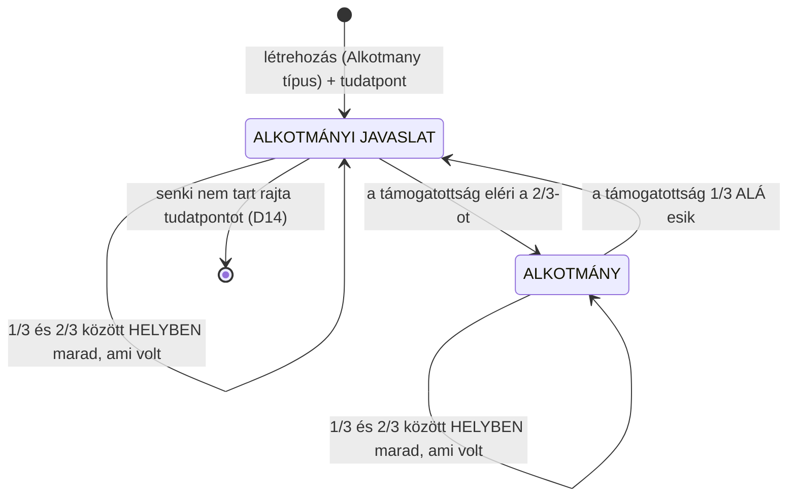

⚠️ **A sáv (1/3 – 2/3) HISZTERÉZIS, és ára van:** az állapot **út-függő** lesz — nem elég a
mai számokat összeadni, végig kell játszani, mikor lépte át a küszöböket. Determinisztikus
(a sorrend rögzített), tehát két gép ugyanoda jut — de **újrajátszás kell, nem összeadás**.
⭐ Csaba ezt vállalta, és jó okkal: enélkül egy alkotmány a küszöb körül **oda-vissza
billegne**, és minden billenés hír lenne.

⛔ **A sáv CSAK HELYBEN véd.** Áthelyezés után nincs hiszterézis: ott a szigorú 2/3-os próba
fut újra (lásd D).

### C) A KÖR — ki számít, és ki nem

⛔⛔ **A nevező a MOSTANI szülő SAJÁT tudatpont-tulajdonosai** (Csaba: *„csak a szülő
sajátjai"*) — **nem** a leszármazottaké. ⭐ Ez felváltja a D27/4 „lefelé terjedő hatókör"
szabályát, és egy csapdát is bezár: **ugyanaz a halmaz adja a számlálót és a nevezőt**, tehát
nem lehet két kör egy gépezetben.

⛔ **A passzívak IS beleszámítanak** — Csaba kimondása: *„egy alkotmánynak akkor lesz súlya, ha
a passzívak is beleszámolódnak."* ⚠️ Ez **megfordít** egy eddigi elvet (*„a passzív figyelő nem
korlátozza a döntést"*) — de csak itt, és ez a megfordítás **maga a súly**: az alkotmányt nem
lehet csendben megszavazni.

⛔ **Tartózkodás nincs** (Csaba: *„nem látom értelmét, azt akár ki is vehetjük innen"*) — a
nem-támogatás úgyis a 2/3 ellen van, tehát a „Tartózkodom" csak azt a látszatot keltené, hogy
tettünk valamit.

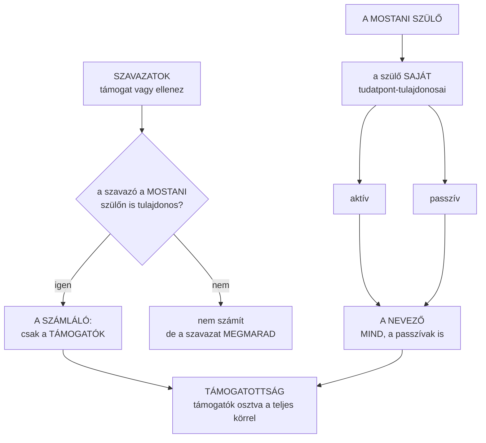

⚠️ **A nevező MOZOG.** Aki egyetlen tudatpontot tesz a szülő gondolatra — akár úgy, hogy soha
nem hallott az alkotmányról —, azzal **hígítja a támogatottságot**. ⭐ Ez részben a lényeg: így
oldódik meg magától a bootstrap-probléma (*tíz ember döntése nem marad érvényben ezer emberen*),
és ezért kell a hiszterézis: a hígulás **1/3-ig nem dönt el semmit**.

### D) AZ ÁTHELYEZÉS — nincs külön „újraszavazás"

⭐⭐⭐ **Ez a modell legszebb következménye.** A korábbi terv külön mechanizmust írt le
(*„felkerül, ott újra javaslat lesz belőle, a felmenő köre újra szavaz, elvetéskor visszakerül"*).
**Ebből semmi nem kell.** Csaba szabálya: *„a szavazatok átjönnek, de csak azok számítanak bele,
akik az új szülőn is tudatpont-tulajdonosok."* Vagyis a szavazat akkor számít, ha a szavazó a
**mostani** szülő tulajdonosa — és az áthelyezés csak **kicseréli a nevezőt**. A státusz ennek a
következménye, nem külön döntés.

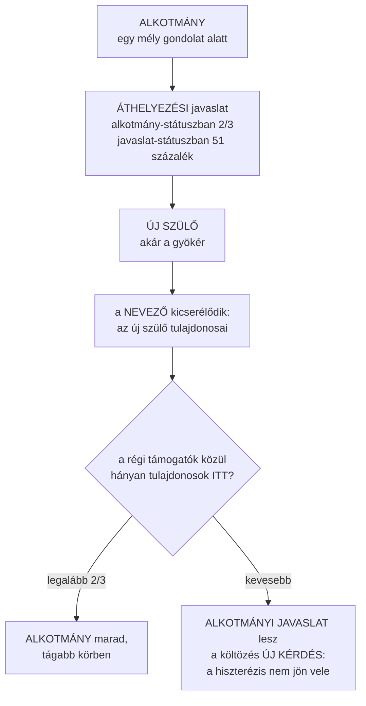

⭐ **A hatókört így sem lehet egyoldalúan tágítani** — de nem azért, mert egy új szavazás
megakadályozza, hanem mert **a tágabb körben egyszerűen nincs meg a 2/3**. *A szabály dolgát
megint elvette a szerkezet.*

⭐ **És a szavazat a HELYEN túl is érvényes** (Csaba: *„a jó elv az jó elv, mindenhol; ha
mégsem jó valakinek máshol, akkor majd módosítja a támogatását"*). A szavazat nem évül el a
költözéstől — csak akkor kerül a számlálóba, ha a szavazó ott is tulajdonos.

### E) A GYÖKÉR — a majdnem elérhetetlen alkotmány

A gyökérben a kör **az egész koino közösség**, tehát 2/3-hoz egymilliárd e-embernél **666 millió
támogató** kellene. ⭐ Csaba döntése: **ez szándékos** — *„egy globális alkotmány lehet majdnem
elérhetetlen, ez fogja adni a súlyát."*

⛔⛔ **És ebből MEGJELENÍTÉSI követelmény lesz, nem csak filozófia.** Csaba: *„egy magasan
támogatott alkotmányi javaslatnak is lehet súlya, ha magas a támogatottsága, elenyésző az
ellenzése, és csak a passzivitás miatt nem lett alkotmány belőle."* Vagyis a kártyán **a három
szám külön látszik** — támogat · ellenez · **néma** —, nem csak a státusz. *A koino bejelent,
nem ítél (D19); a puszta státusz elhallgatná a különbséget aközött, amit elutasítottak, és
amiről nem szóltak.*

### F) A SÚLY A STÁTUSSZAL ÉRKEZIK — szerkesztési javaslat az alkotmányon

Az `Alkotmany` entitást ugyanúgy lehet **módosítani, áthelyezni, törölni** — de a mérce a
célpont **mostani státuszától** függ (Csaba): javaslat-státuszban **51%, a passzívak nélkül**
(vagyis a szokásos koino-nevező); alkotmány-státuszban **2/3, a teljes körrel**.

⭐ *Amíg alkotmányi javaslat, addig sima entitás; amint alkotmány lesz, nehezebb hozzányúlni.*

### G) AMIT EZ A MODELL MEGSZÜNTET

Ez a lista a legfőbb érv mellette — **több gépezetet vesz el, mint amennyit hoz**:

- ⛔ a `fajta: 'altalanos'` mező második jelentése és a 2026-09-10-én bevezetett **`Allaspont`
  művelet**;
- ⛔ az `Allasfoglalas` esemény **csatlakozik/tiltakozik** ága — ezek határidő nélkül
  egyszerűen **szavazatok** *(⭐ ami megmarad belőle: az **`utkozik`**, mert az nem támogatás,
  hanem **két alkotmány viszonya**)*;
- ⛔ a felfelé vitel **külön újraszavazása** és a **visszahelyezés** szabálya;
- ⛔ a D27/4 **lefelé terjedő hatóköre** (egy körre szűkül);
- ⛔ a **tartózkodás** az alkotmányon;
- ⛔ az **ellenzők száma** a státusz-számításból;
- ⛔ és az alkotmányon **tárgytalan**: a döntési idő, a bizonyossági mutató, a medián-küszöb és
  az **érték javaslat**.

⚠️ *Amit hozzátesz, az egyetlen dolog: az **újrajátszás** a hiszterézis miatt.*

### ⏸️ Ami még eldöntendő

- ⛔⛔ **A módosítás: ÉLŐ vagy EGYSZERI?** Ha az alkotmány élő, akkor a szövege logikusan az
  lenne, amelyik módosítás **most** tartja a 2/3-ot — de ez frontálisan ütközik a **harmadik
  fázissal**, ami egyszeri átírás, a lezárás ideje szerint sorba rakva. Ha viszont a módosítás
  határidős marad, **egy gépezetben két mérce lesz**. *Ez a legnehezebb nyitott pont.*
- **Mi ér véget egy alkotmányi javaslattal, amit senki nem akar?** A korábbi „>1/3 ellenzés →
  eltűnik" szabály a B) pont után **tárgytalan** (az ellenzés nem szerepel a számításban).
  ⭐ Javaslat: **a D14** — ha senki nem tart rajta tudatpontot, elfelejtődik. Nem kell hozzá új
  szabály, és **nem termel elakadt pontot** (amit lezárás híján nem is tudnánk bizonyítékkal
  felszabadítani).
- **Ha áthelyezés után visszaesik javaslatba, a helye is visszaugrik?** Javaslat: **nem** —
  marad, ahova vitték, csak a státusza esett vissza. *Egy eseménynek egy következménye legyen.*
- **A kör dönt, de mire vonatkozik az alkotmány?** Ha csak a szülő saját tulajdonosai
  szavaznak, a leszármazottak tulajdonosaira is szól-e. *(A D27/6 szerint semmi nem következik
  belőle automatikusan, tehát lehet, hogy ez nem is kérdés.)*
- **`Tartozkodik` szavazat egy alkotmányra:** kivétel legyen (a szabály-réteg megnevezi), vagy
  néma nem?
- **Az ütközés-jelölés iránya:** kölcsönös-e, vagy irányított állítás marad.
- **Értesítés** *(Csaba mellékesen: „értesítést majd tud majd kérni rá")* — ha egy alkotmány
  költözik vagy státuszt vált, a támogatói **megtudják-e**. A modell enélkül is működik, de a
  „majd módosítja a támogatását" csak akkor igaz, ha **értesül róla**.

---

## Mit őriz próba, és mit nem

| Ábra | Állapot |
|---|---|
| 1. A három fázis | ✅ megépítve, próbák őrzik |
| 2. A töredék-modell | ✅ megépítve, rontás-próbákkal |
| 3. Az entitás életútja | ✅ mind a három eltűnés megépítve |
| 4. A tudatpont útja | ✅ megépítve · ⚠️ a buli-szám **méretlen** |
| 5. Egyesítés/különválás | ⏸️ **TERV** — a mai kód egyszerűbb |
| 6. Általános javaslat | ⏸️ **TERV** — kód nincs hozzá sehol |
