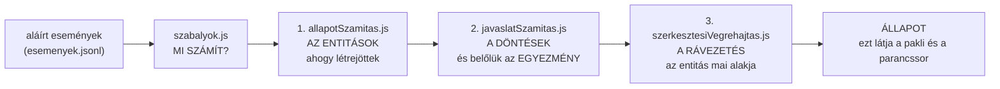
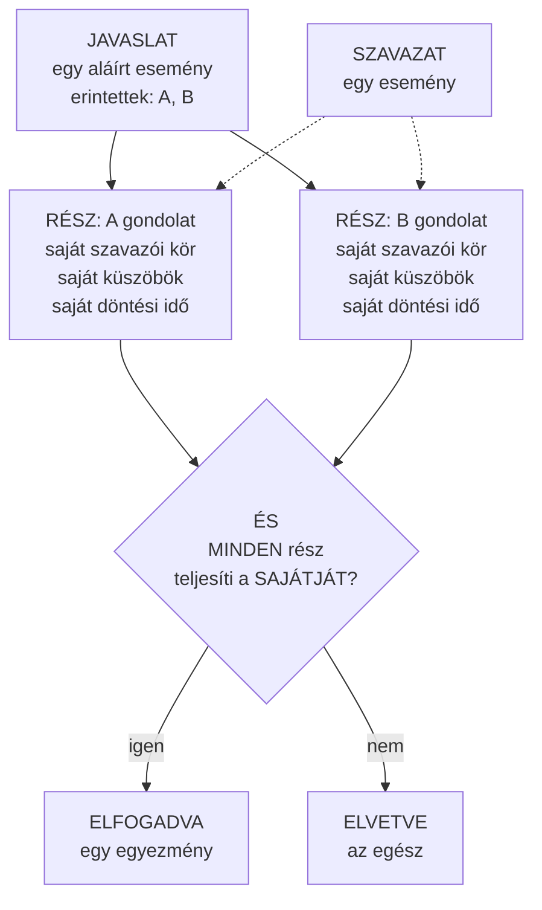
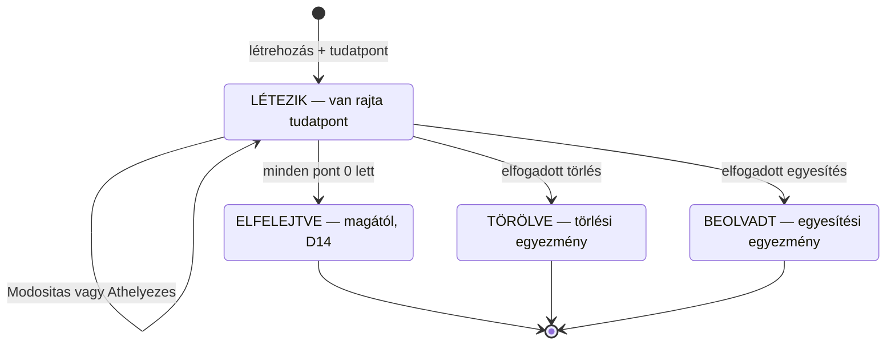
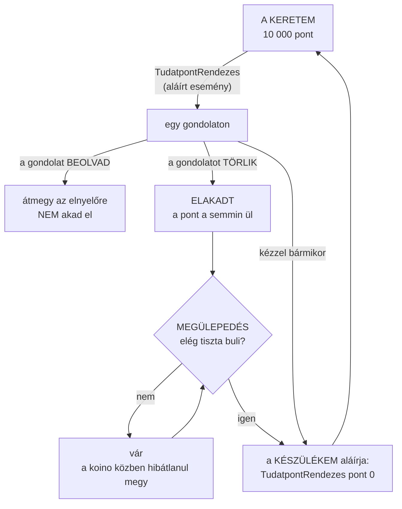
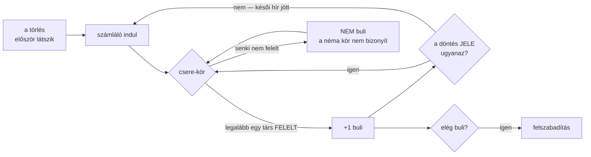
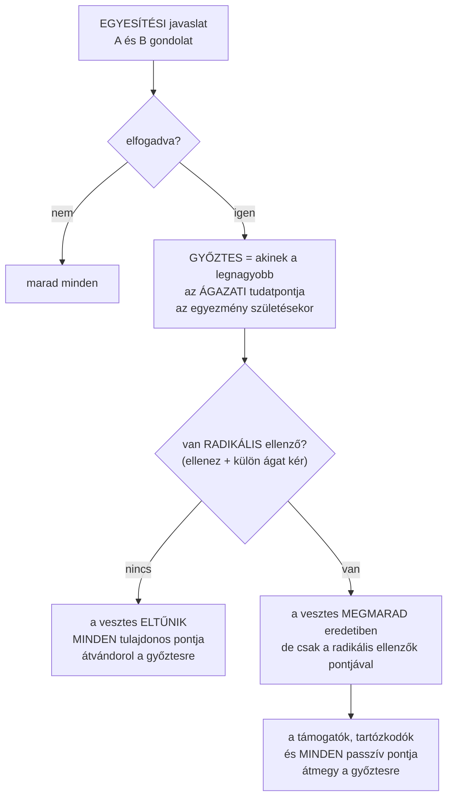
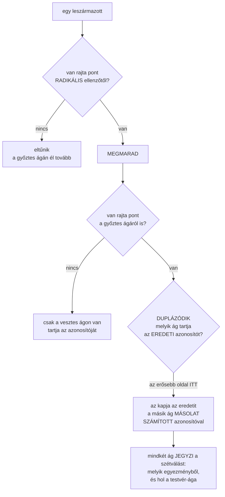
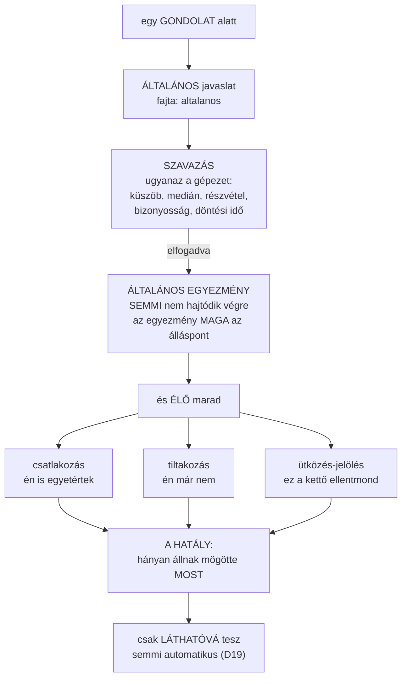
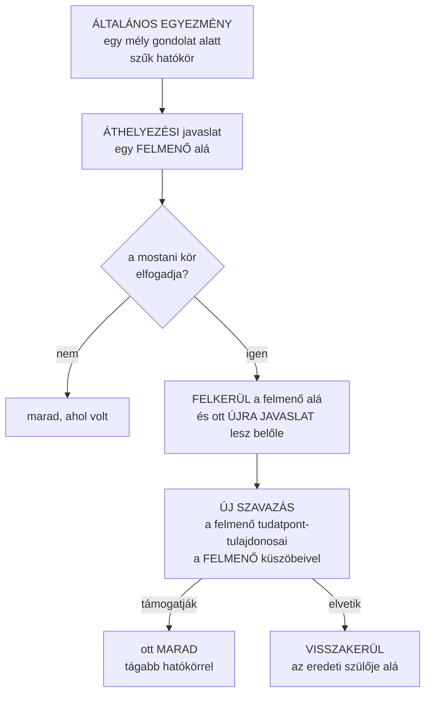

# A koino gépezete — képekben

*Létrehozva: 2026-09-07, Csaba kérésére: „elég összetett rendszer ez ahhoz, hogy készítsünk
egy infografikus dokumentációt."*

> **Mi ez a dokumentum?** A koino **döntés-gépezetének** képei: mi történik egy javaslattal
> a beadástól a végrehajtásig, mi lesz egy entitással, és mi lesz a tudatponttal.
>
> ⚠️ **Két külön része van, és a különbség fontos:**
>
> - Az **1–4. ábra** azt írja le, ami **megépült és próbákkal őrzött**. Ez a mai koino.
> - Az **5–6. ábra** **TERV** — Csaba modellje az egyesítés/különválásra, és az általános
>   javaslat→egyezmény terve. *Ezeket a képet javítva vitatjuk meg, nem a szöveget.*
>
> A képek `mermaid` alakban vannak: a GitHub, a Claude Code és a legtöbb szerkesztő
> rendereli, a nyers szöveg pedig olvasható marad — nulla függőség (6. szabály).

---

## 1. A HÁROM FÁZIS — miért nem lehet kettő

Az állapot nem tárolt adat, hanem **számítás** az aláírt eseményekből (D17). A számítás
három lépésben megy, és **a sorrend nem cserélhető fel**.



**Miért három:**

- a **döntéshez** kell az állapot — a küszöbök a tulajdonosok érték javaslatainak mediánja,
  a részvételi arány nevezője az aktív tulajdonosok köre;
- az **entitás végleges alakjához** kell a döntés — az elfogadott egyezmény írja át a címet,
  helyezi át, tünteti el vagy olvasztja be.

⭐ **A `koino.js` és a `pakli.js` UGYANEZT a hármat futtatja** — ezért mond ugyanazt a
parancssor és a lap. *Ha a felület „javítaná ki" a címet, két igazság lenne.*

⚠️ Ez a három fázis **egy valódi rést zárt be** (2026-09-06, mérve): a javaslat elfogadódott,
az egyezmény megszületett — a gondolat címe mégis a régi maradt, mert a 3. fázis hiányzott.

---

## 2. A TÖREDÉK-MODELL — egy javaslat, N döntés, ÉS

Egy javaslat **több entitást is érinthet**, és ilyenkor **nem egy szavazás van**. A
prototípus töredékekre bontja; a koinóban ugyanez **számítás** (`reszekSzamitasa`).



**A négy szabály, amit ez a kép mond ki:**

| | |
|---|---|
| **A beadáshoz** metszet kell | *„tudatpont MINDEN érintett entitáson"* — enélkül egy egyesítést be lehetne adni úgy, hogy a másik gondolathoz semmi közöd |
| **A szavazáshoz** nem | egy szavazat **abban a részben** számít, ahol a szavazónak van pontja; a többi rész **átugorva** |
| **A lezárás közös** | a leghosszabb rész-döntési idő — a csoport egyben dől el |
| **Az elfogadás ÉS** | egyetlen elbukó rész az egész javaslatot elveti |

⭐ *Aki a gondolatot tartja, az dönt a sorsáról — akkor is, ha a javaslat egy másikat is
érint.*

---

## 3. AZ ENTITÁS ÉLETÚTJA — háromféle eltűnés, három következmény



**A három eltűnés NEM ugyanaz — a tudatpont sorsa dönti el:**

| Eltűnés | Mi lesz a rátett tudatponttal | Mi lesz a gyerekeivel |
|---|---|---|
| **Elfelejtve** (D14) | már 0 volt, nincs mit menteni | **felkerülnek** a legközelebbi élő felmenőhöz |
| **Törölve** | **elakad** — a gazdának vissza kell vennie (4. ábra) | **felkerülnek** a legközelebbi élő felmenőhöz |
| **Beolvadt** | **átmegy** az elnyelőre, emberenként összeadva | **az ELNYELŐHÖZ** kerülnek, nem a nagyszülőhöz |

⛔ **Ez a különbség nem részletkérdés.** Ha a felszabadítás a puszta „eltűnt" listát nézné, a
beolvasztott forrásra is ráírna egy `pont: 0`-t — és a következő számításnál az egyesítés
**nem találná meg a pontokat**, vagyis a felszabadítás **elvenné, amit megőrizni akar**.
*Ugyanaz a szó, két ellentétes következmény.*

⭐ **Az árvák felkerülése** a prototípus kaszkádja: *a gondolat nem tűnhet el csak azért, mert
a szülőjét elfelejtették.* ⚠️ De csak azon a szülőn lépünk át, amit **ismertünk és eltűnt** —
amit **sosem láttunk**, ahhoz nem nyúlunk: az hiány, nem tény (D19).

---

## 4. A TUDATPONT ÚTJA — a kerettől az elakadásig és vissza



**Miért van egyáltalán elakadás?** Mert a gondolat **törlődik** (az eltűnés számítás az
egyezményből, minden készüléken ugyanaz), a pontot viszont csak a **gazdája** veheti le —
a tudatpont-rendezés aláírt esemény, és senki nem írhat alá helyettem (D15).

⭐ **De a készülékem igen** — az az én kulcsom, az én gépem: nem más ír alá helyettem, hanem
a saját készülékem könyvel.

### A megülepedés: BULI, nem óra



⚠️ **Miért nem óra?** *Az idő múlása semmit nem bizonyít* — egy hétvégén kikapcsolt készülék
mellett három nap alatt sem érkezik semmi, egy sűrűn cserélő mellett viszont öt perc alatt
körbeér minden. A buli **azt méri, ami történik**: hogy beszéltem másokkal, és nem hoztak újat.

⚠️ **A döntés jele** = az egyezmény + a lezárás ideje + **a szavazás állása**. Az utolsó tag
egy próbából jött: egy késve érkező szavazat, ami a bizonyosságot nem mozdítja, **nem
változtatja meg a lezárás idejét** — pedig épp azt jelzi, hogy még mindig érkeznek késői
események. *Amit mérni akarunk, az nem a döntés stabilitása, hanem a CSEND.*

⚠️⚠️ **A szükséges buli-szám (ma 3) MÉG NINCS MEGMÉRVE.**

---

## 5. ⏸️ TERV: EGYESÍTÉS ÉS KÜLÖNVÁLÁS — Csaba modellje

> ⚠️ **Ez még nincs megépítve.** A mai kód egyszerűbb: az **első** érintett olvasztja be a
> többit, és nincs külön ág. Az alábbi kép Csaba 2026-09-07-i modellje — *ezt javítsuk.*



**A leszármazottak — egyenként, ugyanezzel a szabállyal:**



### ⭐ „A láncok tudnak ennyire rugalmasak lenni?" — igen, és megnéztem, miért

Csaba kérdése (2026-09-07): *lehet, hogy jobb lenne, ha leszármazottanként az erősebb oldal
tartaná meg az azonosítót — számít ez technikailag?*

**Technikailag semmi nem áll az útjában, és ennek pontos oka van:** a láncokat **soha nem
írjuk át**. Egy aláírt esemény, ami az `X` azonosítóra hivatkozik (`adat.entitas`,
`adat.szulo`, `adat.javaslat`), örökre `X`-re fog hivatkozni. ⭐ **Nem a hivatkozásokat
mozgatjuk, hanem azt SZÁMÍTJUK ki, melyik ág viseli melyik nevet** — és mivel ez számítás
aláírt eseményekből, minden készüléken ugyanaz jön ki. *A rugalmasság nem a láncokban van,
hanem abban, hogy az állapot amúgy sem tárolt, hanem levezetett.*

Ugyanez a gépezet már ma is dolgozik: az egyesítésnél a **pontok** is átkerülnek egy másik
entitásra anélkül, hogy bárki láncát átírnánk — a láncod továbbra is azt mondja, „X: 100", az
állapot pedig azt, hogy ez a 100 pont most az elnyelőn ül.

⚠️ **Két valódi következménye viszont van, és ezeket ki kell mondani:**

1. **Az azonosító a TÖRTÉNETET is hozza.** Aki az eredeti azonosítót kapja, az örökli az
   összes már aláírt hivatkozást: a tudatpontokat, az érték javaslatokat, a rá mutató
   gyerekeket, a róla szóló javaslatokat. A másolat **üresen indul**, és csak azt kapja, amit
   a számítás kifejezetten átad neki.
2. ⛔ **Az eredeti azonosító ELHOZHATÓ, a számított nem.** A `hozd <azonosító>` a társaktól
   kéri el az *eseményt* — az eredeti azonosítóhoz tartozik ilyen, a számítotthoz nem. A
   másolathoz **a forrásokat és az egyezményt** kell elhozni, és utána kiszámolni. *A `hozd`-nak
   ezt meg kell tanulnia; ez nem akadály, hanem feladat.*

### ⭐⭐ És a kérdés, ami emiatt NEM technikai, hanem jelentésbeli

Ha valaki egy éve hivatkozott `X`-re, és ma `X` a **radikális ellenzők** változatát jelöli,
akkor a régi hivatkozás némán az ellenvéleményhez visz — anélkül, hogy a hivatkozó bármit
tett volna. Fordítva ugyanez igaz.

⭐ **A javaslatom, ami mindkét utat biztonságossá teszi:** ne azon múljon a folytonosság,
hogy eltaláljuk, ki „érdemli" az azonosítót, hanem azon, hogy **a szétválás LÁTSZIK**. Mindkét
ág jegyezze, hogy szétválásból származik: **melyik egyezményből**, és **hol a testvér-ága**.
Akkor a régi hivatkozás odaér, és ott azt látja: *„ez a szétválás egyik ága, a másik itt van."*
Ugyanaz a minta, mint a `kihagyottak` listánál: **bejelent, nem hallgat** (D19).

### ⏸️ Amit még el kell dönteni

⚠️ **Mivel mérjük, hogy „többen vannak"?** A **győztes** az ágazati (hierarchikus)
**tudatpont** szerint dől el — de a leszármazottaknál Csaba *„többen vannak"*-ot írt, ami
**fejszámot** sugall. ⛔ Két különböző mérce egy gépezetben csapda: ugyanaz a szétválás
másképp dőlne el a tetején és a levelein. Két tiszta út van:

- **egységesen ágazati tudatpont** — a „ki tartja jobban" mércéje végig ugyanaz;
- **egységesen fejszám** — a „hányan akarják" mércéje végig ugyanaz.

*(A mai koinóban mindkettő kiszámítható; a döntés jelentésbeli, nem technikai.)*

### A három döntés, amit ez a kép rögzít (Csaba, 2026-09-07)

1. **A győztes az ágazati (hierarchikus) tudatpont szerint dől el** — nem a felsorolás
   sorrendje szerint —, és **az egyezmény születésének pillanatában** érvényes érték számít
   (minden gépen ugyanaz, és később nem mozdul).
2. **A „radikális ellenző" = aki ellenzett ÉS külön ágat kért.** Ez a prototípus
   `kulonvalasIgeny` mezője: szavazáskor kérdezik meg, *„ha a döntés nem a te álláspontodat
   követi, kérsz-e külön ágat?"* — tartózkodásnál a kérdés meg sem jelenik. ⚠️ Ehhez a
   `Szavazat` eseménynek **új mezőt kell kapnia**.
3. **A másolat azonosítója SZÁMÍTOTT** — az eredetiéből és az egyezményéből származik.

### ⭐ És amivel ez a harmadik pont NEM megy szembe

Megnéztem: **nincs olyan leírt szabály, amit ez megsértene.** A koino szabálya az
**eseményről** szól (`js/esemeny/esemeny.js`): *„az azonosító a gondolat lenyomata, tehát nem
külön adat, hanem a gondolat neve"* — és ez **érintetlen marad**: minden esemény azonosítója
továbbra is a saját tartalmának lenyomata, ez hitelesíti az aláírást.

Ami változik, az egy **kimondatlan feltevés**: ma minden *entitás* azonosítója történetesen
egyszersmind egy *esemény* azonosítója is. A javasolt kimondás:

> ⭐ **Minden azonosító aláírt eseményekből SZÁMÍTHATÓ.** A lenyomat ennek a különleges
> esete: ott a számítás maga az azonosság.

**Két helyen van gyakorlati következménye, és mindkettőre van válasz:**

- az `allapotSzamitas.js` ma az entitás azonosítójával keresi meg a **létrehozó eseményt** —
  a másolatnál nincs ilyen, tehát a másolatot a végrehajtás **állítja elő** (ahogy az
  egyezményt is);
- a `hozd <azonosító>` böngésző-lekérés ma a **társaktól kéri el** az eseményt — egy
  számított azonosítóra ez nem működik, viszont nem is kell: aki a forrás-eseményeket
  ismeri, az **kiszámolja**. A `hozd`-nak ezt tudnia kell.

⚠️ *És egy őszinte megjegyzés: ezzel a lépéssel a koino elfogad egy olyan nevet, ami mögött
nincs egyetlen aláírás — csak egy levezetés. A levezetés bemenete viszont végig aláírt, és
minden gép ugyanoda jut. A D17 szelleme szerint ez rendben van; de ez az első ilyen név,
ezért írjuk le, ne csússzon be észrevétlenül.*

---

## 6. ⏸️ TERV: AZ ÁLTALÁNOS JAVASLAT → EGYEZMÉNY

> A D27 leírja, mit kell tudnia; kód nincs hozzá **sem a prototípusban** — ez tervezés, nem
> átültetés. Az alábbi a javaslatom, a fenti gépezetre ráépítve.



### Ami már MEGVAN belőle

- a `fajta` mező (`szerkesztesi` / `altalanos`) és hogy **az általánosból nem következik
  entitás-változás** — kemény szabály, próba őrzi;
- a szavazás teljes gépezete, változatlanul;
- **az egyezmény teljes értékű entitás** (D27/5): azonos azonosító, tudatpont, küszöbök,
  gyerekek — és mind a négy szerkesztési művelet vonatkozik rá. *(A prototípusnál ez
  bővítés: ott az egyezményre csak áthelyezés indítható.)*

### Amit meg kell építeni — és a javaslatom rá

**a) A három élő művelet: EGY esemény-alak.**

```
Allasfoglalas  →  adat: { egyezmeny, allas, masik?, indoklas? }
                  allas: 'csatlakozik' | 'tiltakozik' | 'utkozik'
                  masik: csak ütközésnél — a másik egyezmény azonosítója
```

⭐ Miért egy alak három helyett: ugyanaz az érv, mint a `meghivas`/`felhatalmazas`/`tanusitas`
hármasnál (`allitokRola`) — **közös váz, más jelentés**; ha az alak változik, egy helyen
változik. És **„az utolsó nyer"** e-emberenként: aki csatlakozott, majd tiltakozik, annál a
tiltakozás számít. *Ettől lesz a hatály élő, külön visszavonás-mechanizmus nélkül.*

**b) A csatlakozó AKTÍV résztvevő** (D27/3). Nem külön szabály: a csatlakozás **döntés-alakító
tett**, tehát ugyanúgy aktívvá tesz, ahogy a szavazás (`szerepAktivalasa` mintája). ⭐ Ez old
meg egy feszültséget: ha az egyezményt később módosítani akarják, **a csatlakozók szavaznak
róla** — nem kell se nullázni a csatlakozásokat, se változatokhoz kötni őket.

**c) A hatókör a HELYBŐL** (D27/4). Aki állást foglalhat: akinek tudatpontja van **az entitáson,
ami alatt az egyezmény áll — vagy annak bármely leszármazottján**. A gyökérben: **minden tag**.

⚠️ **Ehhez a hierarchikus tudatpont JOGOSULTSÁGGÁ válik** — eddig a fontosság mutatója volt.
Nincs új mechanizmus, csak egy meglévő egy szinttel feljebb. ⭐ És a hatókör tágítása
(feljebb helyezés) maga is javaslat → **közösségi döntés**.

**d) Az örökölt küszöbök.** D27/1: *„az induló küszöbök a szülő gondolattól öröklődnek, utána
viszont saját érték javaslatokkal formálhatók."* ⚠️ Ma a koino az entitás **saját** érték
javaslataiból számol, és ha nincs, az `ALAP_KUSZOBOK`-ot veszi. A javaslat: ha egy entitásnak
nincs saját érték javaslata, **a szülőjéé** érvényes, és csak azon túl az alapérték. ⭐ Ez
minden entitásra jó általánosítás, nem csak az egyezményre.

**e) Semmi automatikus** (D27/6). Sem a tiltakozók többsége, sem az ütközés **nem érvénytelenít**
semmit. A rendszer **bejelent, nem bíráskodik** (D19) — a vita helye az egyezmény alatti
gyerek-gondolatokban van.

### ⭐⭐ A FELFELÉ VITEL — a hatókör tágítása maga is szavazás (Csaba, 2026-09-07)

> *„Ezeket az egyezményeket áthelyezési javaslattal lehetne felfelé vinni az ágazatában…
> úgy, hogy ott ismét javaslat lesz belőle, amiről már szélesebb körben történik egy újabb
> szavazás. Ha elvetik, akkor visszakerül az eredeti szülője alá, ha támogatják, akkor ott
> maradhat. Az új szavazás a felmenő értékeivel történik."*

Ez teszi a D27/4-et gyakorlattá: a **pozíciónak jelentése van** (minél feljebb, annál
többen szólhatnak hozzá), és a feljebb vitel **nem adminisztratív lépés, hanem döntés** — de
nem azé, aki kezdeményezi, hanem **azé a köré, ahova érkezik**.



**Amit ez megold — és amiért szép:**

- ⭐ **A hatókört nem lehet egyoldalúan tágítani.** Hiába viszi valaki feljebb az
  álláspontját, a tágabb kör **maga dönt** arról, hogy magára veszi-e. *Nem lehet egy nagy
  közösség nyakába varrni egy kis ág döntését.*
- ⭐ **Az új szavazás a FELMENŐ értékeivel megy** — ott az ő küszöbei, az ő részvételi
  aránya érvényes. Vagyis nem viszi magával a régi, szűk kör mércéjét.
- ⭐ **Az elvetés nem büntetés, hanem visszahelyezés**: az egyezmény érvényes marad ott, ahol
  eddig is volt. *Csak a hatóköre nem nőtt meg.*

⏸️ **Amit ehhez el kell dönteni:**

- **A csatlakozók a költözéssel maradnak?** Javaslom: igen — a **tény örök**, a hatály él;
  aki csatlakozott, az az álláspont mögött áll, nem a helye mögött. (De akkor a tágabb körben
  ők már „meglévő támogatók", ami befolyásolja az új szavazás részvételi arányát.)
- **Mi történik, amíg az új szavazás fut?** Két olvasat: (a) az egyezmény **már fent van**, és
  a szavazás arról szól, maradhat-e — ez Csaba szövegéből következik; (b) csak akkor költözik,
  ha elfogadták. ⭐ Az (a) mellett szól, hogy így a felmenő köre **látja is, amiről szavaz**.
- **Lehet-e egy lépésben több szintet ugrani**, vagy csak a közvetlen szülőig?

### ⏸️ Ami még eldöntendő

- **Az egyesítés csatlakozói** (D27 nyitva hagyta): ha két általános egyezményt egyesítenek,
  a csatlakozóik **összeadódnak-e**. ⭐ Az 5. ábra modellje szerint igen — a pontok is
  emberenként adódnak össze —, de ez külön kimondást kíván.
- **Az ütközés-jelölés iránya**: kölcsönös-e (A ütközik B-vel ⇒ B ütközik A-val), vagy
  irányított állítás marad.
- **A felfelé vitel** három nyitott pontja (fent).

---

## Mit őriz próba, és mit nem

| Ábra | Állapot |
|---|---|
| 1. A három fázis | ✅ megépítve, próbák őrzik |
| 2. A töredék-modell | ✅ megépítve, rontás-próbákkal |
| 3. Az entitás életútja | ✅ mind a három eltűnés megépítve |
| 4. A tudatpont útja | ✅ megépítve · ⚠️ a buli-szám **méretlen** |
| 5. Egyesítés/különválás | ⏸️ **TERV** — a mai kód egyszerűbb |
| 6. Általános javaslat | ⏸️ **TERV** — kód nincs hozzá sehol |
